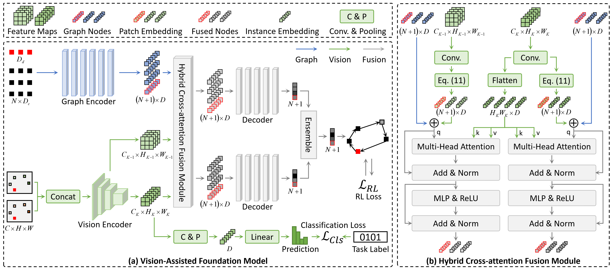

# VaFM


_Vision-Assisted Foundation Model for Solving Multi-Task Vehicle Routing Problems_


---

<div align="center">
    
</div>


## Installation


```bash
conda env create -f environment.yaml
conda activate VaFM
pip install -e .
```

## Download Data and Saved models

```bash
unzip data.zip
unzip logs.zip
```
Put them under:
   - ./data/
   - ./checkpoints/


## Test

```bash
# N=50
python test.py --size 50 --batch_size 150 --checkpoint './logs/1018-routefinder-vis-fusion-loc-depot-CBLTW-value-xL-orange-01cls-nodeAtt-2dec-avg-50/2024-10-22_09-37-43/checkpoints/epoch_299.ckpt'
# N=100
python test.py --size 100 --batch_size 64 --checkpoint './logs/1018-routefinder-vis-fusion-loc-depot-CBLTW-value-xL-orange-01cls-nodeAtt-2dec-avg/2024-10-19_14-08-10/checkpoints/epoch_299.ckpt'
```

### Running

```bash
python run.py experiment=main/rf/rf-moe-L-50
```
